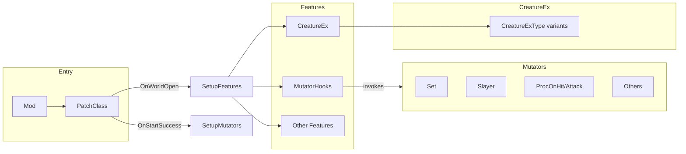

# CHANGEExpansion Project Map

## 1. Purpose and architecture

**CHANGEExpansion** extends ACEmulator loot and gameplay via:

- **Features** — Harmony patches that add or alter behavior (e.g. fake properties, procs, pets).
- **Mutators** — Post-generation loot modifiers (sets, slayers, procs, etc.) driven by `Settings.Mutators` and hooked by `MutatorHooks`.
- **CreatureEx** — Creature subtypes with special AI/behavior (Boss, Vampire, Tank, etc.), enabled via `Settings.CreatureFeatures`.

Config is in [Settings.json](Settings.json) (mapped to [Settings.cs](Settings.cs)). Pools (odds, targets, sets, creature types, spell groups, augments) are in enums and `Settings` dictionaries.

---

## 2. Entry points

| File | Role |
|------|------|
| [Mod.cs](Mod.cs) | `BasicMod` entry; constructs `PatchClass(this)`. |
| [PatchClass.cs](PatchClass.cs) | Loads `Settings`, calls `MutatorHooks.SetupMutators()` on start, `SetupFeatures()` on world open (Harmony `PatchCategory` per enabled `Feature` and `CreatureExType`), registers commands, unpatch on stop. |
| [Meta.json](Meta.json) | Mod metadata (Name, Description, Enabled, etc.). |

---

## 3. Features (patch categories)

All live under [Features/](Features/). Enabled via `Settings.Features`; each has `[HarmonyPatchCategory(nameof(Feature.X))]`.

| Feature | File | Purpose |
|---------|------|---------|
| **MutatorHooks** | MutatorHooks.cs | Hooks into loot/corpse/generator/inventory/emote/vendor; runs enabled Mutators. Required for any mutator to run. |
| **CreatureEx** | CreatureEx.cs | Replaces creatures with CreatureEx subtypes based on `CreatureChance` or FakeInt 10029; uses `Settings.CreatureFeatures`. |
| **BonusStats** | BonusStats.cs | Adds bonus to attributes, vitals, and skills via `GetBonus()` (FakeProperty-based). |
| **TimeInGame** | TimeInGame.cs | On logout, stores session time into `FakeFloat.TimeInGame` for total time played. |
| **CorpseInfo** | CorpseInfo.cs | (Readme says deprecated) Corpse-related fake props. |
| **PetEx** | PetEx.cs | Extended pet behavior. |
| **PetAttackSelected** | PetAttackSelected.cs | Pet attacks selected target. |
| **PetMessageDamage** | PetMessageDamage.cs | Pet damage messaging. |
| **PetStow** | PetStow.cs | Pet stow behavior. |
| **PetSummonMultiple** | PetSummonMultiple.cs | Summon multiple pets. |
| **PetExShareDamage** | PetExShareDamage.cs | Pet shares damage. |
| **SummonCreatureAsPet** | SummonCreatureAsPet.cs | Summon creature as pet. |
| **ProcOnHit** | ProcOnHit.cs | On-hit proc handling (cloak-style). |
| **ProcOnAttack** | ProcOnAttack.cs | On-attack proc (e.g. non-Aetheria). |
| **ProcRateOverride** | ProcRateOverride.cs | Overrides cloak/Aetheria proc rate from `Settings` (CloakProcRate, AetheriaProcRate). |
| **FakePropertyCache** | FakePropertyCache.cs | Caches FakeInt/FakeFloat from equipment for performance; optional but recommended. |
| **FakeXpBoost** | FakeXpBoost.cs | Fake XP boost property. |
| **FakeLeech** | FakeLeech.cs | Life/mana leech. |
| **FakePercentDamage** | FakePercentDamage.cs | Percent damage modifier. |
| **FakeCombo** | FakeCombo.cs | Combo mechanics. |
| **FakeCulling** | FakeCulling.cs | Culling behavior. |
| **FakeItemLoot** | FakeItemLoot.cs | Custom item loot. |
| **FakeKillTask** | FakeKillTask.cs | Kill task handling. |
| **FakeReflection** | FakeReflection.cs | Reflection (non-spell). |
| **FakeSpellReflection** | FakeSpellReflection.cs | Spell reflection. |
| **FakeDurability** | FakeDurability.cs | Custom durability (patch category commented out). |
| **FakeEquipRestriction** | FakeEquipRestriction.cs | Equip restrictions. |
| **FakeSpellMeta** | FakeSpellMeta.cs | Spell meta (patch category commented out). |
| **FakeSpellSplitSplash** | FakeSpellSplitSplash.cs | Spell split/splash projectiles. |
| **FakeSpellChain** | FakeSpellChain.cs | Spell chaining. |
| **FakeMissileSplitSplash** | FakeMissileSplitSplash.cs | Missile split/splash. |
| **OverrideSpellProjectiles** | OverrideSpellProjectiles.cs | Custom spell projectile handling (category commented out). |
| **OverrideCreatePlayer** | OverrideCreatePlayer.cs | Custom player creation (category commented out). |
| **OverrideCheckUseRequirements** | OverrideCheckUseRequirements.cs | Usage requirement checks. |
| **LifeMagicElementalMod** | LifeMagicElementalMod.cs | Life projectile scaling by ElementalDamageMod. |
| **DamageOverTimeConversion** | DamageOverTimeConversion.cs | Converts damage to DoT. |
| **EquipPostCreation** | EquipPostCreation.cs | Equip starter gear after creation. |
| **UnarmedWeapon** | UnarmedWeapon.cs | Unarmed weapon behavior. |
| **ItemLevelUpGrowth** | ItemLevelUpGrowth.cs | Equipment augments on level by type. |
| **CreatureMaxAmmo** | CreatureMaxAmmo.cs | Override max-ammo switch after 3 missed ranged attacks. |
| **Hardcore** | Hardcore.cs | Hardcore mode (death limits, time between deaths). |
| **Ironman** | FakeIronman.cs | Ironman (e.g. Hardcore lives via FakeInt.HardcoreLives). |
| **AutoLoot** | (Settings only) | Loot profile path / username usage. |

---

## 4. Mutators

Base: [Mutator.cs](Mutator.cs). Instances created from [MutatorSettings.cs](MutatorSettings.cs) (Events, Odds, TreasureTargets, WeenieTypeTargets). Loaded in `MutatorHooks.SetupMutators()`; each mutator is registered per `MutationEvent` flag. Mutators mutate at: Loot, Corpse, Generator, Factory, EnterWorld, Inventory, EmoteGive, VendorBuy.

| Mutation | File | Role |
|----------|------|------|
| **SampleMutator** | SampleMutator.cs | Example mutator (Containers \| EmoteGive, Odds Always). |
| **Set** | Set.cs | Assigns equipment set by `ItemTypeEquipmentSets` (e.g. Armor/Clothing → Armor sets, Cloak/Jewelry → Cloak sets). |
| **Slayer** | Slayer.cs | Adds slayer by tier; uses `SlayerPower`, `Slayers` (CreatureTypeGroup). Default targets Weapon, Odds Rare. |
| **ProcOnHit** | Mutators/ProcOnHit.cs | Adds cloak-style proc; uses `ProcOnSpells` (SpellGroup). |
| **ProcOnAttack** | Mutators/ProcOnAttack.cs | On-attack proc on loot. |
| **Enlightened** | Enlightened.cs | (Commented in Settings) EnterWorld/Containers. |
| **IronmanLocked** | IronmanLocked.cs | Containers. |
| **GrowthItem** | GrowthItem.cs | (Commented) Growth augments by type; uses GrowthAugments, GrowthFixedLevelAugments, GrowthTierLevelRange, GrowthXpBase/ScaleByTier. |
| **Resize** | Resize.cs | EnterWorld resize. |
| **AutoScale** | AutoScale.cs | EnterWorld scaling. |
| **ShinyPet** | ShinyPet.cs | Pet mutation. |
| **TowerLocked** | TowerLocked.cs | Location/tower lock. |
| **LocationLocked** | LocationLocked.cs | Location lock. |
| **RandomColor** | RandomColor.cs | Random color. |

---

## 5. CreatureEx (CreatureExType)

Controlled by [CreatureExType.cs](Creatures/CreatureExType.cs). Base: [CreatureEx.cs](Features/CreatureEx.cs) (feature) and [CreatureEx.cs](Creatures/CreatureEx.cs) (creature base). Spawn via `/cex [type]`, `CreatureChance`, or FakeInt 10029. Only types in `Settings.CreatureFeatures` get their Harmony category patched.

| Type | File | Behavior |
|------|------|----------|
| **Horde** | Horde.cs | (Only one enabled by default in Settings.) |
| **Accurate** | Accurate.cs | Flat hit chance. |
| **Boss** | Boss.cs | Bigger, more XP, rotating weakness, volleys, spell projectiles. |
| **Comboer** | Comboer.cs | Combo counter; casts ring at 5/10. |
| **Banisher** | Banisher.cs | Destroys summoned pets of attack target. |
| **Berserker** | Berserker.cs | Attribute buff at low health. |
| **Drainer** | Drainer.cs | Drains mana/stamina. |
| **Duelist** | Duelist.cs | Avoids damage when facing player. |
| **Evader** | Evader.cs | Flat evade chance. |
| **Exploder** | Exploder.cs | Countdown then % health explosion. |
| **Healer** | Healer.cs | Heals nearby. |
| **Merger** | Merger.cs | Merges with same-type creatures; more HP/XP/stats. |
| **Puppeteer** | Puppeteer.cs | Spawns unattackable copies; all die with it. |
| **Rogue** | Rogue.cs | Disarms when attacking from behind. |
| **Shielded** | Shielded.cs | Shield absorbs damage; replenishes. |
| **SpellBreaker** | SpellBreaker.cs | Interrupts cast and reflects damage. |
| **SpellThief** | SpellThief.cs | Steals random enchantment. |
| **Stomper** | Stomper.cs | Radial damage based on distance. |
| **Stunner** | Stunner.cs | Periodically stuns nearby player. |
| **Tank** | Tank.cs | Intercepts damage for nearby at reduced rate. |
| **Vampire** | Vampire.cs | Heals from damage dealt. |
| **Warder** | Warder.cs | Prevents targeting other nearby non-Warder with spells. |

(Others in enum: Avenger, Bard, Necromancer, Poisoner, Reaper, Runner, Splitter, Suppresser — see [Creatures.md](Creatures.md).)

---

## 6. Enums and groups

| Enum / Helper | File | Use |
|---------------|------|-----|
| **Feature** | Enums/Feature.cs | All feature names for PatchCategory and Settings. |
| **Mutation** | Enums/Mutation.cs | Mutator class names. |
| **MutationEvent** | Enums/Mutation.cs | Loot, Corpse, Generator, Factory, EnterWorld, Inventory, EmoteGive, VendorBuy. |
| **CreatureExType** | Creatures/CreatureExType.cs | Creature variant list. |
| **EquipmentSetGroup** | Enums/EquipmentSetGroup.cs | Armor, Cloak → EquipmentSet arrays for Set mutator. |
| **TargetGroup** | Enums/TargetGroup.cs | TreasureItemType_Orig sets (Weapon, Wearables, etc.) for mutator targets. |
| **OddsGroup** | Enums/OddsGroup.cs | Common/Rare/Always → tier chances for mutators. |
| **CreatureTypeGroup** | Enums/CreatureTypeGroup.cs | Popular/Full → CreatureType arrays for Slayer. |
| **WeenieTypeGroup** | Enums/WeenieTypeGroup.cs | e.g. Container for mutator WeenieType targets. |
| **SpellGroup** | (in SpellSettings/helpers) | Spell ID pools for procs (e.g. CloakOnly). |
| **AugmentGroup** | (referenced in Settings) | Augment pools for GrowthItem. |

---

## 7. Helpers and other files

| Path | Purpose |
|------|---------|
| [Helpers/ExHelpers.cs](Helpers/ExHelpers.cs) | Extension/helper methods. |
| [Helpers/SpellHelper.cs](Helpers/SpellHelper.cs) | Spell-related helpers. |
| [Helpers/SpellSettings.cs](Helpers/SpellSettings.cs) | Spell config (e.g. split/splash). |
| [Range.cs](Range.cs) | IntRange for tier ranges. |
| [Odds.cs](Odds.cs) | Odds/tier chance structure. |
| [Commands.cs](Commands.cs) | Admin commands (sim, t1, t2, clean, hp). |

---

## 8. Settings (high level)

- **Features** / **CreatureFeatures**: lists of enabled Feature and CreatureExType.
- **Mutators**: list of MutatorSettings (Mutation name, Events, Odds, TreasureTargets, WeenieTypeTargets).
- **MutatorPath**: directory for mutator config.
- **ItemTypeEquipmentSets**: TreasureItemType_Orig → EquipmentSetGroup for Set mutator.
- **Slayers**, **SlayerPower**: Slayer mutator.
- **ProcOnSpells**: ProcOnHit spell group.
- **Growth***: GrowthItem mutator (augments, tier ranges, XP).
- **BonusCaps**, **CloakProcRate**, **AetheriaProcRate**, **Hardcore***, **CreatureChance**, **SpellSettings**.
- **Odds**, **TargetGroups**, **WeenieTypeGroups**, **CreatureTypeGroups**, **EquipmentSetGroups**, **SpellGroups**, **AugmentGroups**: named pools used by mutators and settings.

---

## 9. Documentation already in repo

- [Readme.md](Readme.md): Overview, mutator events/targets/odds, dependencies, ProcOnHit/Set/Slayer, features (EnableOnAttackForNonAetheria), enums, todo, scratch ideas.
- [Creatures.md](Creatures.md): CreatureEx types and behavior.
- [Affixes and Augments.md](Affixes and Augments.md): Augment/Affix/Operation system.
- [TODO.md](TODO.md): Task list.
